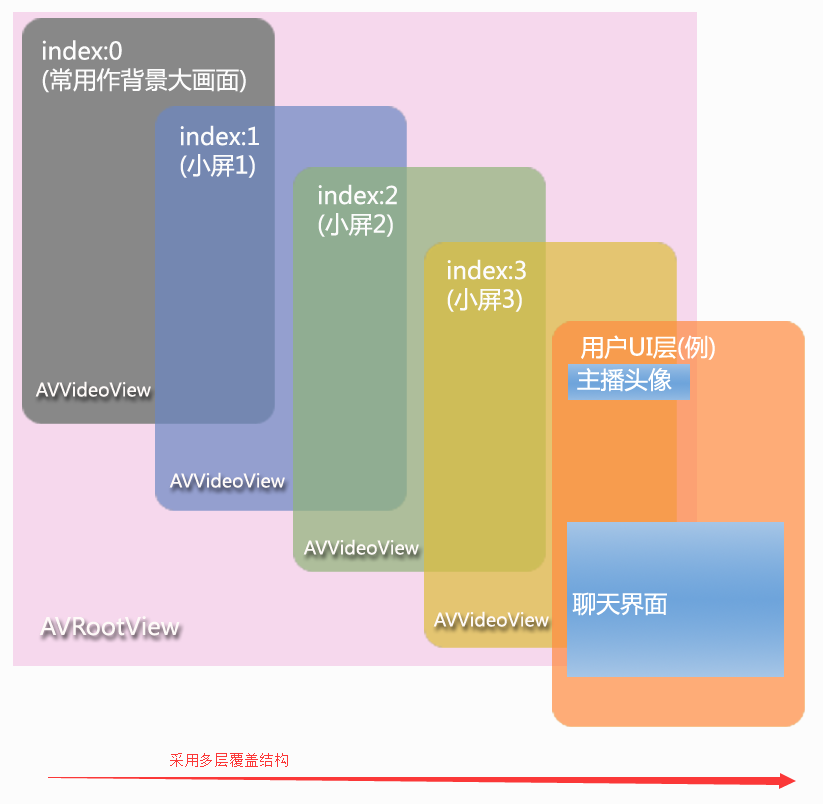

# 视频聊天快速接入
------
该业务旨在为开发者提供双人视频，乃至多人视频会议的服务

##初始化
在初始化时可以配置呼叫超时时间、忙时(通话过程中)自动拒接。
为保证收到来电消息，需要配置来电回调

接口名|接口描述
:--|:--:
init|视频聊天业务初始化

参数类型|说明
:--|:--:
ILVCallConfig|初始化配置参数

```java
ILVCallManager.getInstance().init(new ILVCallConfig()
            .setTimeOut(30)         // 超时时间为30秒
            .setAutoBusy(true));    // 忙时自动拒接模式
ILVCallManager.getInstance().addIncomingListener(this);
```

##设置来电回调
添加来电回调，登录成功后，有来电会通过回调通知上层

接口名|接口描述
:--|:--:
addIncomingListener|添加来电回调

参数类型|说明
:--|:--:
ILVIncomingListener|来电回调

```java
ILVCallManager.getInstance().addIncomingListener(this);
```

##发起呼叫
发起通话时，直接调用makeCall，填入对方的id即可发起呼叫
可以通过setCallType设置通话类型(*纯语音呼叫也是可以的哦*)

接口名|接口描述
:--|:--:
makeCall|发起视频聊天

参数类型|说明
:--|:--:
String|呼叫目标id
ILVCallOption|呼叫选项

```java
ILVCallOption option = new ILVCallOption(ILiveLoginManager.getInstance().getMyUserId())
            .callTips("重要电话")                               // 电话描述
            .setCallType(ILVCallConstants.CALL_TYPE_VIDEO);     // 视频电话
int callId = ILVCallManager.getInstance().makeCall(remoteId, option);
if (ILiveConstants.INVALID_INTETER_VALUE != callId) {
    // 呼叫成功
    ...
}
```

##接听来电
在收到来电时，会进入onNewIncomingCall或onNewMutiIncomingCall(多人)
此时可以调用acceptCall或rejectCall进行接听或拒接

接口名|接口描述
:--|:--:
onNewIncomingCall|来电回调

参数类型|说明
:--|:--:
int|呼叫id
int|呼叫类型(CALL_TYPE_VIDEO、CALL_TYPE_AUDIO)
String|发起方id
String|呼叫主题
String|用户自定义数据
long|时间戳(1970年1月1日以来的秒数)

```java
@Override
public void onNewIncomingCall(int callId, final int callType, final String fromUserId, 
                                          String strTips, String strCustom, long timeStamp){
    if (0 == ILVCallManager.getInstance().acceptCall(mCurIncomingId, 
                        new ILVCallOption(fromUserId).setCallType(callType))) {
        // 接听成功
    }
}
```

##通话回调
对于通话可以设置回调来获取通话状态

接口名|接口描述
:--|:--:
addCallListener|添加通话回调

参数类型|说明
:--|:--:
ILVCallListener|用户自定义通话回调

```java
ILVCallManager.getInstance().addCallListener(new ILVCallListener() {
    @Override
    public void onCallEstablish(int callId) {
        // 通话建立成功
    }

    @Override
    public void onCallEnd(int callId, int endResult, String endInfo) {
        // 通话结束
    }

    @Override
    public void onException(int iExceptionId, int errCode, String errMsg) {
        // 通话异常情况捕获
    }
});
```
            
###设置渲染层
> 渲染层级示例图 在界面层xml插入一个AVRootView,音视频数据最终是通过AVRootView渲染出来。AVRootView实际上不是一层View而是多层AVVideoView的叠加。
> 用户可以自己通过bindIdAndView绑定用户到view


* 示例

```java
    <com.tencent.ilivesdk.view.AVRootView
        android:id="@+id/av_root_view"
        android:layout_width="match_parent"
        android:layout_height="match_parent"
        android:background="@color/white" />
        
        
        avRootView = (AVRootView) findViewById(R.id.av_root_view);
        ILVCallManager.getInstance().initAvView(avRootView);
```  

更多接口参考[API文档](https://zhaoyang21cn.github.io/ilivesdk_help/android_help/)
