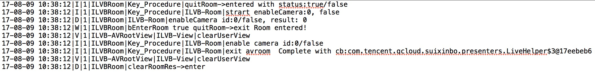

# 关键路径的LOG 

## 获取日志
在遇到无法解决的问题时，请提供相关日志文件，ILiveSDK的日志文件分三个模块:

SDK|目录
:--|:--:
iLiveSDK|tencent/imsdklogs/包名/ilivesdk_YYYYMMDD.log
IMSDK|tencent/imsdklogs/包名/imsdk_YYYYMMDD.log
AVSDK|tencent/imsdklogs/包名/QAVSDK_YYYYMMDD.log


## Android Studio过滤日志

<br/>
*在ILiveSDK 1.6.0 以后版本过滤LOG关键字 [KEY] 会搜到创建房间加入房间的关键路径*
<br/>

## 创建一个房间  流程正确LOG如下


- 具体包括了10个步骤 解释如下    

```C
1. 初始化步骤
[17-11-09 17:00:38][KEY][I][ILiveSDK][initSdk->init][appid:1400027849|accountType:11656|version:1.7.2.0.7|abi:armeabi-v7a]  

2. 设置渲染层       
[17-11-09 17:02:00][KEY][I][ILVBRoom][initAvRootView][mRootView:null|view:52829144]
    
3. iLive登录   
[17-11-09 17:00:38][KEY][I][ILVBLogin][iLiveLogin][id:ghost]
[17-11-09 17:00:39][KEY][I][ILVBLogin][iLiveLogin->im login success][env:0]
[17-11-09 17:00:39][DEV][I][ILVBLogin][iLiveLogin->startContext Success]   

4. 创建房间   
[17-11-09 17:02:22][KEY][I][ILVBRoom][createRoom][roomId:80778|imSupport:true|imGroupType:AVChatRoom|imGroupId:|avSupport:true|role:HD|autoCamera:true] 

5. 直播聊天室创建完毕
[17-11-09 17:02:22][KEY][I][ILVBRoom][enterIMGroup->succuess][iEnterMask:0]

6. AV房间创建完毕
[17-11-09 17:02:22][KEY][I][ILVBRoom][enterAVRoom->succuess][iEnterMask:1]

7. 打开摄像头
[17-11-09 17:02:22][KEY][I][ILVBRoom][autoOpenCamera->enableCamera][autoCamera:true|curCamera:-1|cameraId:0] 

8. server回调用户上线
[17-11-09 17:02:22][KEY][I][ILVBRoom][onEndPointEvent->hasCamera][eventId:3|users:ghost,]  

9. 渲染
[17-11-09 17:02:22][KEY][I][ILVB-AVRootView][renderVideoView][index:0|id:ghost|type:1|left:0|top:0|width:480|height:640|hashcode:52916470]      

10. 摄像头上报成功回调    
[17-11-09 17:02:22][KEY][D][ILVBRoom][enableCamera->onSuccess][cameraId:0]  

```


## 加入一个房间  流程正确LOG如下


- 具体包括了8个步骤 解释如下 


```C
1. 初始化 
[17-11-09 17:00:38][KEY][I][ILiveSDK][initSdk->init][appid:1400027849|accountType:11656|version:1.7.2.0.7|abi:armeabi-v7a]
  
2. 设置渲染层
[17-11-09 17:02:00][KEY][I][ILVBRoom][initAvRootView][mRootView:null|view:52829144]  

3. iLive登录
[17-11-09 17:00:38][KEY][I][ILVBLogin][iLiveLogin][id:ghost]
[17-11-09 17:00:39][KEY][I][ILVBLogin][iLiveLogin->im login success][env:0]
[17-11-09 17:00:39][DEV][I][ILVBLogin][iLiveLogin->startContext Success]  

4. 加入房间  
[17-11-09 17:02:16][KEY][I][ILVBRoom][joinRoom][roomId:80588|imSupport:true|imGroupType:AVChatRoom|imGroupId:|avSupport:true|role:Guest|autoCamera:false]

5. 直播聊天室加入成功    
[17-11-09 17:02:16][KEY][I][ILVBRoom][enterIMGroup->succuess][iEnterMask:2]

6. AV房间加入成功       
[17-11-09 17:02:16][KEY][I][ILVBRoom][enterAVRoom->succuess][iEnterMask:0]   

7. 获取server 成员上线回调 
[17-11-09 17:02:16][KEY][I][ILVBRoom][onEndPointEvent->hasCamera][eventId:3|users:jackwang1982,]
[17-11-09 17:02:16][KEY][D][ILVB-AVSDKContext][requestRemoteVideo->enter][length:1]   

8. 渲染界面
[17-11-09 17:02:16][KEY][I][ILVB-AVRootView][renderVideoView][index:0|id:jackwang1982|type:1|left:0|top:0|width:480|height:640|hashcode:529e0428]    

```

## 退出一个房间 流程正确的 LOG 如下



- 具体包括了 6 个步骤，解释如下：

```C
1. 开始退出房间
ILVBRoom: Key_Procedure|quitRoom->entered with status:true/false

2. 关闭摄像头（如果摄像头处于开启状态）
ILVBRoom: Key_Procedure|ILVB-Room|strart enableCamera:0, false
ILVBRoom: ILVB-Room|enableCamera id:0/false, result: 0

3. 开始退出 AV 房间
ILVBRoom: bEnterRoom true quitRoom->exit Room entered!

4. 清理渲染视图（如果视图存在）
ILVB-AVRootView: ILVB-View|clearUserView

5. 退出 AV 房间成功回调
ILVBRoom: Key_Procedure|ILVB-Room|exit avroom  Complete with cb...

6. 清理房间资源
ILVBRoom: clearRoomRes->enter
```
