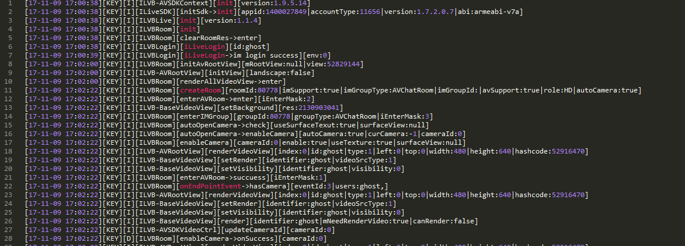
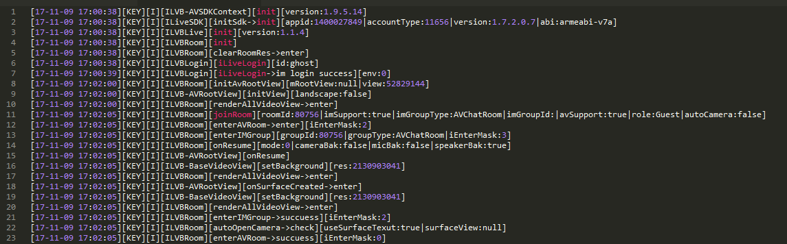

# 关键路径的LOG 

## 获取日志
在遇到无法解决的问题时，请提供相关日志文件，ILiveSDK的日志文件分三个模块:

SDK|目录
:--|:--:
iLiveSDK|tencent/imsdklogs/包名/ilivesdk_YYYYMMDD.log
IMSDK|tencent/imsdklogs/包名/imsdk_YYYYMMDD.log
AVSDK|tencent/imsdklogs/包名/QAVSDK_YYYYMMDD.log


## Android Studio过滤日志

<br/>
*在ILiveSDK 1.03 以后版本过滤LOG关键字 Key_Procedure 会搜到创建房间加入房间的关键路径*
<br/>

## 创建一个房间  流程正确LOG如下



- 具体包括了10个步骤 解释如下    

```C
1. 初始化步骤
ILiveSDK: Key_Procedure｜initSdk->init appid:1400001692, accountType:884    

2. 设置渲染层       
ILVBRoom: Key_Procedure|ILVB-Room|init root view    
AVVideoGroup: Key_Procedure|ILVB-AVVideoGroup|init sub views
    
3. iLive登录   
ILVBLogin: Key_Procedure｜ILVB-iLiveLogin strart |id:will     
ILVBLogin: Key_Procedure｜ILVB-iLiveLogin|login success    

4. 创建房间   
ILVBRoom: Key_Procedure|ILVB-Room|start create room:6357 enter with im:true|video:true   

5. 直播聊天室创建完毕
ILVBRoom: Key_Procedure|createRoom->im room ok:6357     

6. AV房间创建完毕
ILVBRoom: Key_Procedure|ILVB-Room|enter av room complete result: 0      

7. 打开摄像头
ILVBRoom: Key_Procedure|ILVB-Room|strart enableCamera     

8. server回调用户上线
ILVBRoom: Key_Procedure|ILVB-Room|onEndpointsUpdateInfo myself id has camera will     

9. 渲染
AVRootView: Key_Procedure|ILVB-AVRootView|renderVideoView->enter index:0|0,0,1080,1845       

10. 摄像头上报成功回调    
ILVBRoom: Key_Procedure|ILVB-Room|enable camera id:0/true     

```


## 加入一个房间  流程正确LOG如下



- 具体包括了8个步骤 解释如下 


```C
1. 初始化 

ILiveSDK: Key_Procedure｜initSdk->init appid:1400001692, accountType:884   
  
2. 设置渲染层
ILVBRoom: Key_Procedure|ILVB-Room|init root view      
AVVideoGroup: Key_Procedure|ILVB-AVVideoGroup|init sub views   

3. iLive登录
ILVBLogin: Key_Procedure｜ILVB-iLiveLogin strart |id:will      
ILVBLogin: Key_Procedure｜ILVB-iLiveLogin|login success       

4. 加入房间  
ILVBRoom: Key_Procedure|joinRoom->id: 6352 isIMsupport: true       

5. 直播聊天室加入成功    
ILVBRoom: Key_Procedure|joinLiveRoom joinIMChatRoom callback succ    

6. AV房间加入成功       
ILVBRoom: Key_Procedure|ILVB-Room|enter av room complete result: 0        

7. 获取server 成员上线回调 
ILVBRoom: Key_Procedure|ILVB-Endpoint | requestRemoteVideo id [willguo]     

8. 渲染界面
AVRootView: Key_Procedure|ILVB-AVRootView|renderVideoView->enter index:0| 0,0,1080,1845      

```
