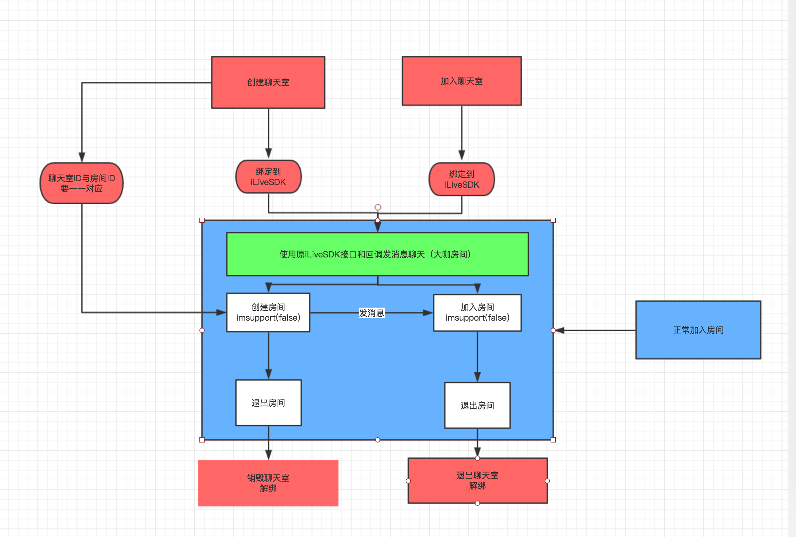

### 大咖房间

大咖房间是指大咖主播创建一个聊天室房间，其他人可以加入这个房间进行文本聊天。当大咖准备好了，可以开启视频直播，聊天室房间增加音视频房间变成一个正常房间。
	
	



### 几个关键步骤
#### 创建房间和绑定

```java     
         TIMGroupManager.getInstance().createGroup("AVChatRoom", new ArrayList<String>(), "AVChatRoom", "" + chatId.getText(), new TIMValueCallBack<String>() {
                @Override
                public void onError(int i, String s) {
                    if (i == 10025) {   //已在房间中,重复进入房间
                        ILiveLog.e(TAG, ILiveConstants.LOG_KEY_PR + "|createRoom->im room exist!");
                        isHost = true;
                        quiteChatBtn.setVisibility(View.VISIBLE);
//                        ILiveRoomOption option = new ILiveRoomOption(""+chatId.getText());
                        ILiveRoomManager.getInstance().bindIMGroupId(""+chatId.getText());

                    }
                }

                @Override
                public void onSuccess(String s) {
                    Toast.makeText(LiveActivity.this, "create chatRoom succ!! ", Toast.LENGTH_SHORT).show();
//                    ILiveRoomOption option = new ILiveRoomOption();
                    ILiveRoomManager.getInstance().bindIMGroupId(""+chatId.getText());
                }
            });
```      

#### 加入房间和绑定
```java     
TIMGroupManager.getInstance().applyJoinGroup("" + chatId.getText(), "request to join" + chatId.getText(), new TIMCallBack() {
                @Override
                public void onError(int i, String s) {
                    if(i == 10025){
                        ILiveRoomManager.getInstance().bindIMGroupId("" + chatId.getText());
                    }
                    //已经在是成员了
                    isHost = false;
                    quiteChatBtn.setVisibility(View.VISIBLE);

                }

                @Override
                public void onSuccess() {
                    isHost = false;
                    ILiveRoomManager.getInstance().bindIMGroupId("" + chatId.getText());
                    Toast.makeText(LiveActivity.this, "join chatRoom succ!!!", Toast.LENGTH_SHORT).show();
                }
            });
```  

#### 房间号对应聊天室接口
```java     
    public interface GenerateFunc {
        String generateImGroupId(int roomid);
    }
``` 

根据房间ID生成聊天室ID 默认方式是直接int转String  内容一致           


#### 退出聊天室
 
```java     
    if (isHost) {
                TIMGroupManager.getInstance().deleteGroup("" + chatId.getText(), new TIMCallBack() {
                    @Override
                    public void onError(int i, String s) {
                        //已经在是成员了
//                        isHost = false;
                        Toast.makeText(LiveActivity.this, "delete chatRoom failed!! ", Toast.LENGTH_SHORT).show();
                    }

                    @Override
                    public void onSuccess() {
                        ILiveRoomManager.getInstance().unBindIMGroupId();
                        quiteChatBtn.setVisibility(View.VISIBLE);
                        Toast.makeText(LiveActivity.this, "delete chatRoom succ!! ", Toast.LENGTH_SHORT).show();
                    }
                });
            } else {
                TIMGroupManager.getInstance().quitGroup("" + chatId.getText(), new TIMCallBack() {
                    @Override
                    public void onError(int i, String s) {
                        //已经在是成员了
//                        isHost = false;
                        Toast.makeText(LiveActivity.this, "quite chatroom failed!! ", Toast.LENGTH_SHORT).show();
                    }

                    @Override
                    public void onSuccess() {
                        ILiveRoomManager.getInstance().unBindIMGroupId();
                        Toast.makeText(LiveActivity.this, "quite chatroom succ!! ", Toast.LENGTH_SHORT).show();
                    }
                });
            }
```  


